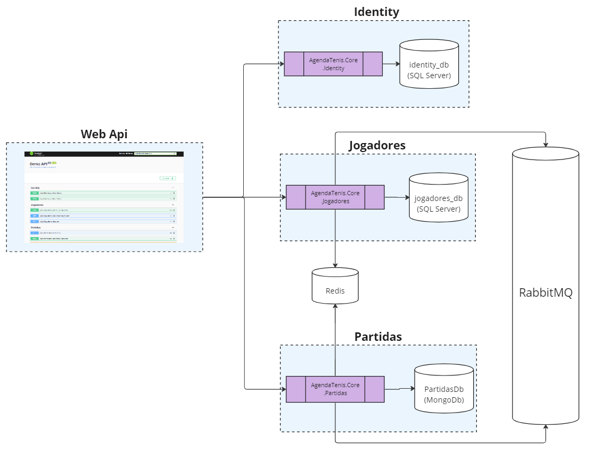

# AgendaTenis

Fonte: [standret](https://br.freepik.com/fotos-gratis/uma-raquete-de-tenis-e-uma-bola-de-tenis-nova-em-uma-quadra-recem-pintada_10138885.htm#query=raquete%20tenis&position=2&from_view=keyword&track=ais)

## Índice

- [Sobre](#sobre)
- [Features](#features)
- [Valores de domínio](#valores_dominio)
- [Descrição técnica do sistema](#descricao_tecnica)
- [Como executar](#como_executar)
- [Exemplo de uso da API](#exemplo_uso)
- [Considerações sobre o projeto](#consideracoes)

## Sobre

AgendaTenis é uma API na qual tenistas podem criar um perfil e agendar jogos com outros tênistas.\
A API conta com um sistema de pontuação que divide os tenistas em categorias (atp, avançado, intermediário e iniciante).\
O tênista pode buscar outros tênistas especificando a região (país, estado e cidade) e a categoria do adversário desejado e convidá-lo para um jogo.\
Quando um convite é feito, o adversário pode aceitar ou recusar o convite.\
Após o jogo, o desafiante registra o placar da partida e em seguida o adversário pode confirmar ou contestar o placar registrado.\
Se o adversário confirmar o placar, então a partida é validada e são adicionados 10 pontos para o vencedor e subtraídos 10 pontos do perdedor.

## Features

### Criar conta
Cadastro simples na plataforma com e-mail e senha.

**Rota**: Api/Identity/CriarConta\
**Método HTTP**: POST

### Gerar token (login)
Gera um token jwt para autenticação do usuário.\
Basta informar o e-mail e senha para obter o token.

**Rota**: Api/Identity/GerarToken\
**Método HTTP**: POST

### Completar perfil
Quando o usuário cria uma conta no sistema, ele fornece apenas as credenciais básicas (e-mail e senha).\
Para ter um perfil de tenista completo no sistema, o usuário deverá utilizar esta feature e informar alguns dados adicionais como:
- Nome
- Sobrenome 
- Data de nascimento
- Telefone
- País
- Estado
- Região
- Cidade
- Mão dominante
- Backhand
- Estilo de jogo

Com isso, o usuário terá um perfil completo que poderá ser encontrado por outros jogadores interessados em jogar com ele.

**Rota**: Api/Jogadores/Perfil/Completar\
**Método HTTP**: POST

### Buscar adversários
Essa feature é muito útil para o tênista encontrar adversários cadastrados na plataforma.\
É possível encontrar outros tenistas filtrando por região e categoria.

**Rota**: Api/Jogadores/Adversarios/Buscar?pais=Brasil&estado=S%C3%A3o%20Paulo&cidade=Campinas&categoria=2\
**Método HTTP**: GET\
**Observações**: Se necessário utilize a seção [Valores de domínio](#valores_dominio) para encontrar os códigos para **Categoria**, **ModeloPartida**, **StatusConvite** e **StatusPlacar**

### Obter resumo
O usuário logado pode acessar este endpoint para obter seu resumo de tênista.\
Com isso ele irá obter as seguintes informações:
- Id
- Nome Completo
- Idade
- Pontuação
- Categoria

**Rota**: Api/Jogadores/Resumo\
**Método HTTP**: GET\
**Observações**: Se necessário utilize a seção [Valores de domínio](#valores_dominio) para encontrar os códigos para **Categoria**, **ModeloPartida**, **StatusConvite** e **StatusPlacar**

### Histórico de partidas
Esta feature busca as partidas do usuário logado (inclusive partidas canceladas e as que ainda não aconteceram).\
Para não onerar o banco de dados e a performance da aplicação, a consulta do histórico de partidas é paginada.\
Dessa forma o usuário precisa informar o número da página e os items por página.

**Rota**: Api/Partidas/Historico\
**Método HTTP**: GET\
**Observações**: Se necessário utilize a seção [Valores de domínio](#valores_dominio) para encontrar os códigos para **Categoria**, **ModeloPartida**, **StatusConvite** e **StatusPlacar**

### Convidar para jogar
Quando o usuário quiser convidar alguém para jogar, ele poderá utilizar esta feature.\
Para isso, basta informar as seguintes informações:
- AdversarioId (**Este é o UsuarioId e não o JogadorId**)
- DataDaPartida
- DescricaoLocal
- ModeloDaPartida

**Rota**: Api/Partidas/Convites/Convidar\
**Método HTTP**: POST
**Observações**: Conforme expliquei na seção [Considerações sobre o projeto](#consideracoes), o sistema ainda não valida se o valor AdversarioId pertence a um Usuário cadastrado no sistema. Por isso, é muito importante informar um UsuarioId que existe.
UsuarioId do seu adversario pode ser obtido em BuscarAdversarios (é o campo **usuarioId** do response).

### Convites para jogar pendentes
Criei esta feature para que o usuário possa obter a lista de convites para jogar pendentes.\
Por exemplo, se o jogador A convidar o jogador B para uma partida, então quando o jogador B fizer login no sistema e acessar este endpoint,\ 
ele poderá ver o convite do jogador A.

**Rota**: Api/Partidas/Convites/Pendentes\
**Método HTTP**: GET

### Responder convite
Após verificar seus convites pendentes, o jogador poderá aceitar ou recusar os convites.\
Para isso, ele pode utilizar a feature Responder Convite na qual ele informa o Id da Partida (pode ser obtido utilizando a feature convites pendentes) e o status de aceitação (2 para aceitar e 3 para recusar).

**Rota*: Api/Partidas/Convites/Responder\
**Método HTTP**: POST\
**Observações**: Se necessário utilize a seção [Valores de domínio](#valores_dominio) para encontrar os códigos para **Categoria**, **ModeloPartida**, **StatusConvite** e **StatusPlacar**

### Registrar placar
Depois do jogo, o desafiante da partida poderá registrar o resultado na partida.

**Rota**: Api/Partidas/Placar/Registrar\
**Método HTTP**: POST

### Confirmar placar pendências
Com esta feature o usuário pode ver suas pendências de confirmação de placar.\
Observa-se que pendências de confirmação de placar existem quando:
1. Você é o adversário e jogou uma partida 
2. O desafiante da partida registrou o placar
3. Você ainda não confirmou o placar registrado pelo desafiante (dessa forma existe uma pendência de confirmação de placar)

**Rota**: Api/Partidas/Placar/Pendentes\
**Método HTTP**: GET

### Responder Placar
Essa feature conclui o ciclo de vida de uma partida.\
Ela deverá ser usada pelo adversário da partida para confirmar ou contestar o placar registrado pelo desafiante.\
Se o placar for confirmado, então as seguintes ações irão acontecer:

1. Vencedor é registrado na partida
2. Evento "Placar Confirmado" é emitido
3. Evento "Placar Confirmado" é consumido
    1. Vencedor ganha 10 pontos
    2. Perdedor perde 10 pontos

## Valores de domínio <a name = "valores_dominio">
Valores numéricos de domínio (enums) são utilizado em diversos locais da aplicação, tais como parâmetros de query (ie., feature Buscar Jogadores), em requests http (ie., feature Responder Convite) e responses da api (ie., feature obter resumo do tenista).\
Segue abaixo a lista de valores de domínio:
- Categoria
    - Atp = 1
    - Avançado = 2
    - Intermediário = 3
    - Iniciante = 4 

- Jogadores:
    - Desafiante = 1
    - Adversario = 2
    
- ModeloPartida:
    - SetUnico = 1
    - MelhorDeTresSets = 2
    - MelhorDeCincoSets = 3
    
- StatusConvite:
    - Pendente = 1
    - Aceito = 2
    - Recusado = 3
    
- StatusConvite:
    - AguardandoConfirmacao = 1
    - Aceito = 2
    - Contestado = 3

## Descrição técnica
A aplicação possui 3 contextos delimitados que são totalmente desacoplados entre si.
Os 3 contextos são:
* Identity
* Jogadores
* Partidas
    
A imagem abaixo ilustra a topologia da aplicação:

#### Contexto Identity
O contexto identity é utilizado apenas para realizar o cadastro de usuários na aplicação e geração de token de acesso jwt.

- Projeto: AgendaTenis.Core.Identity
- Modelo de dados:
    - Usuários
        - Id: Guid
        - Email: string 
        - Senha: string
- Banco de Dados: SQL Server
- Acesso a dados: O acesso a dados foi abstraído com uso do EntityFrameworkCore
- Observações:
    - Utilizei o "Repository Pattern" para não depender diretamente do EntityFrameworkCore
    - Utilizei o FluentValidation para realizar validações de dados
    - Utilizei o Mediatr para auxiliar na implementação do padrão Command
- Dependências:
    - AgendaTenis.BuildingBlocks.Notificacoes
    - FluentValidation
    - Mediatr
    - Microsoft.AspNetCore.Authentication.JwtBearer
    - Microsoft.EntityFrameworkCore.SqlServer
    - Microsoft.Extensions.Identity.Core

#### Contexto Jogadores
O contexto jogadores é utilizado para registrar o perfil do tênista e sua pontuação atual para que sua categoria possa ser definida

- Projeto: AgendaTenis.Core.Jogadores
- Modelo de dados:
    - Jogador
        - Id: Guid
        - UsuarioId: Guid
        - Nome: string
        - Sobrenome: string
        - DataNascimento: DateTime
        - Telefone: string
        - Pais: string
        - Estado: string
        - Cidade: string
        - MaoDominante: string
        - Backhand: string
        - EstiloDeJogo: string
        - PontuacaoId: Guid
        - DataCriacao: DateTime
    - Pontuação
        - Id: Guid
        - JogadorId: Guid
        - PontuacaoAtual: double
        - DataCriacao: DateTime
- Banco de Dados: SQL Server
- Cache: Redis
- Mensageria: RabbitMQ
- Acesso a dados: O acesso a dados foi abstraído com uso do EntityFrameworkCore
- Observações:
    - Ao contrário do contexto identity, aqui eu **não** utilizei o "Repository Pattern". Dessa forma, estou injetando o DbContext diretamente nos fluxos. O motivo desta decisão foi testar um abordagem diferente do repository pattern.
    - **Não** Utilizei o FluentValidation para realizar validações de dados, criei validações simples utilizando POCO (Plain Old CLR Object)
    - Utilizei o Mediatr para auxiliar na implementação do padrão Command
- Dependências:
    - AgendaTenis.BuildingBlocks.Notificacoes
    - AgendaTenis.BuildingBlocks.Cache
    - AgendaTenis.BuildingBlocks.EventBus
    - Mediatr
    - Microsoft.EntityFrameworkCore.SqlServer

#### Contexto Partidas
O contexto de partidas registra todas as partidas já criadas no sistema.

- Projeto: AgendaTenis.Core.Partidas
- Modelo de dados:
    - Partida
        - Id: string
        - DesafianteId: string
        - AdversarioId: string
        - DataDaPartida: DateTime
        - DescricaoLocal: string
        - ModeloDaPartida: ModeloPartidaEnum
        - StatusConvite: StatusConviteEnum
        - StatusPlacar: StatusPlacarEnum
        - VencedorId: string
        - JogadorWO: string
            - Sets []: 
                - NumeroSet
                - GamesDesafiante
                - GamesAdversario
                - TiebreakDesafiante
                - TiebreakAdversario
- Banco de Dados: MongoDb
- Cache: Redis
- Mensageria: RabbitMQ
- Acesso a dados: O acesso a dados foi abstraído com uso do MongoDB.Driver
- Observações:
    - Utilizei o "Repository Pattern" para não depender diretamente do MongoDB.Driver
    - Utilizei o Mediatr para auxiliar na implementação do padrão Command
- Dependências:
    - AgendaTenis.BuildingBlocks.Notificacoes
    - AgendaTenis.BuildingBlocks.Cache
    - AgendaTenis.BuildingBlocks.EventBus
    - Mediatr
    - MongoDB.Driver
    
### Migrations e seed data
No ambiente de desenvolvimento (ASPNETCORE_ENVIRONMENT=Development), você não precisa se preocupar em executar as migrations do entity framework, pois criei um Bootstrapper que é executado quando a aplicação é iniciada.\
O bootstrapper, chamado de IdentityBootstrapper, irá executar as migrations automaticamente e também criará 4 usuários que você pode utilizar se quiser.\
Segue a lista de usuários criados automaticamente: 
- Maria
    - Email: maria@gmail.com
    - Senha: maria123456789
    - Pais: Brasil
    - Estado: São Paulo
    - Cidade: Campinas
- Claudio
    - Email: claudio@gmail.com
    - Senha: claudio123456789
    - Pais: Brasil
    - Estado: São Paulo
    - Cidade: Campinas
- Joao
    - Email: joao@gmail.com
    - Senha: joao123456789
    - Pais: Brasil
    - Estado: São Paulo
    - Cidade: Campinas
- Clara
    - Email: clara@gmail.com
    - Senha: clara123456789
    - Pais: Brasil
    - Estado: São Paulo
    - Cidade: Campinas
    
Todos os 4 usuários já estão com perfil completo. 
    
### Docker
- Criei um arquivo Dockerfile para o projeto AgendaTenis.WebApi
- Criei um arquivo docker-compose com todos os serviços necessário para a aplicação rodar
- Dessa forma a aplicação poderá ser executada apenas com as instruções presentes na seção [Como Usar](#como_executar)
    
    
## Como executar 
1. git clone {repourl}
2. cd .\AgendaTenis\
3. docker-compose pull
4. docker-compose build
5. docker-compose up

Observação: É um pré-requisito que você tenha o docker instalado em sua máquina

## Exemplo de uso da API 
1. Execute a aplicação conforme instruído em [Como executar](#como_executar)
2. Abra o swagger https://localhost:4000/swagger/index.html (após executar o passo anterior, pode levar alguns instantes até que os containeres estejam todos executando, então é necessário aguardar um pouco até que o swagger esteja de pé).
3. Crie uma nova conta em Criar Conta ou use uma das [conta pré-cadastradas](#contas_pre_cadastradas)
4. Faça uma chamada para o método Gerar Token informando um e-mail e senha válidos
5. Copie o token gerado e clice no botão "Authorize" do swagger
6. Cole o token gerado no campo do modal que abriu (não precisa escrever "Bearer ", é só colocar o token mesmo)
7. Se você está usando uma conta nova (e não uma das contas pré-cadastradas, você precisa completar seu perfil te tenista. Faça isso chamando o método Jogadores/Perfil/Completar. Se você está usando uma das 4 contas pré-cadastradas, então não precisar completar o perfil, pois elas já estão com perfil completo.
8. Após completar seu perfil, você pode obter um resumo do seu perfil no método Jogadores/Resumo
9. Busque adversários para marcar jogos no método Jogadores/Adversarios/Buscar. Atualmente só tem adversarios que moram em campinas, então forneça os seguintes parâmetros Pais: Brasil, Estado: São Paulo, Cidade: Campinas
10. Após executar o passo 9, você vai obter uma lista de jogadores. Copie um dos **usuarioId** da lista (anote o nome do usuário que você está copiando o usuarioId, para facilitar sua vida no passo 14)
11. Agora você vai convidar a pessoa do **usuarioId** do passo anterior para um jogo. Para isso chame o endpoint Partidas/Convites/Convidar e informe o usuarioId
12. Se você consultar o método Partidas/Historico, vai encontrar a partida criada no passo anterior com StatusConvite: 1 (que significa Pendente)
13. Agora, em uma outra aba do navegador, abra o swagger novamente (mantenha a primeira aba do swagger aberta, pois ainda vamos utilizá-la)
14. [2º aba do navegador] Faça login com o usuário que você anotou o nome no passo 10.
15. [2º aba do navegador] Consulte o método Partidas/Convites/Pendentes. Você vai ver um convite pendente de confirmação.
16. [2º aba do navegador] Faça uma chamada para o método Partidas/Convites/Responder informando o id da partida (é o id do response do passo anterior)
17. Agora já temos uma partida entre os jogadores
18. [1º aba do navegador] Vamos informar o placar da partida. Faça uma chamada para o método Partidas/Placar/Registrar (tem que ser na primeira aba do navegador, pois é a aba do desafiante da partida). **Observação: Em vencedorId você deve preencher o UsuarioId de um dos jogadores da partida**
19. Agora a partida está com placar registrado pelo desafiante.
20. [2º aba do navegador] Vamos confirmar o placar registrado pelo desafiante. Para isso, faça uma chamada para o método Partidas/Placar/Responder e informe o id da partida e true em "confirmarPlacar".
21. Como você respondeu true em confirmar placar no passo anterior, então a partida foi validada e a pontuação dos tenistas será atualizada.
22. [1º aba do navegador] Faça uma chamada para o método ObterResumo e veja a pontuação
23. [2º aba do navegador] Faça uma chamada para o método ObterResumo e veja a pontuação
    
## Considerações sobre o projeto 
1. Hoje só é possível convidar 1 jogador para a partida, ou seja, o sistema ainda não suporta partidas de duplas
2. Na feature convidar para jogar, o sistema ainda não valida o valor informado em AdversarioId.
    No futuro vou criar esta validação, mas por enquanto **é muito importante informar o UsuarioId do seu adversario e não o JogadorId**. 
    O UsuarioId do seu adversario pode ser obtido em Buscar Adversarios.
3. Ainda não criei testes de unidade. É algo que está no backlog.
4. No projeto AgendaTenis.Core.Identity, criei uma implementação bastante simples de cadastro de usuários. No futuro será interessante melhorar esta implementação, utilizando bibliotecas robustas como o Microsoft.AspNetCore.Identity que conta com um modelo de dados bastante completo para autenticação e autorização de usuário.
5. Inicialmente eu ia utilizar o projeto AgendaTenis.Workers.EventBus para ser o worker da aplicação e consumir mensagens do RabbitMQ, mas não deu tempo de configurar ele para rodar dentro do container docker.\
    Então criei um worker com a mesma funcionalidade dentro do projeto AgendaTenis.WebApi chamado PlacarConfirmadoWorker.\
    É necessário avaliar o quanto esse worker vai consumir de recursos da API e, se for uma quantidade considerável de recursos, então é melhor utilizar o projeto separado.\
    Observa-se que não excluí o projeto AgendaTenis.Workers.EventBus, mas ele vai ficar inativo por enquanto.
6. Seria interessante criar uma interface de usuário para os tenistas utilizarem o sistema. Talvez um aplicativo mobile ou uma Web UI.

